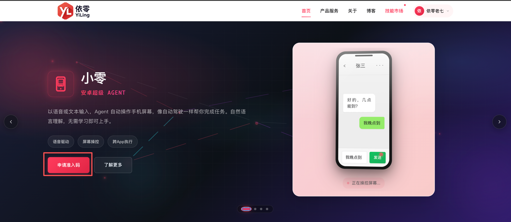
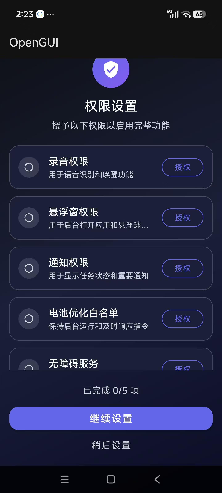
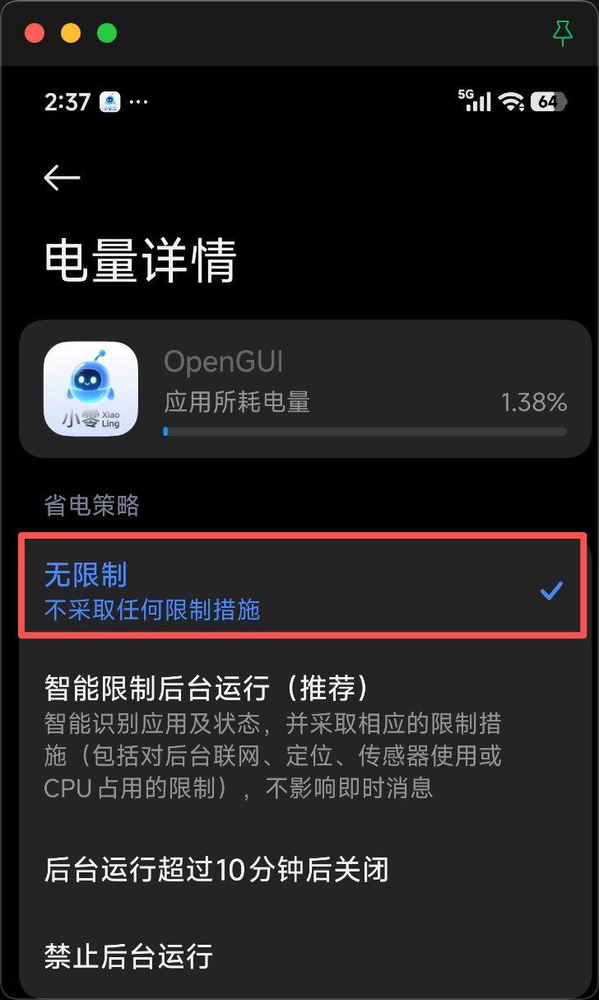
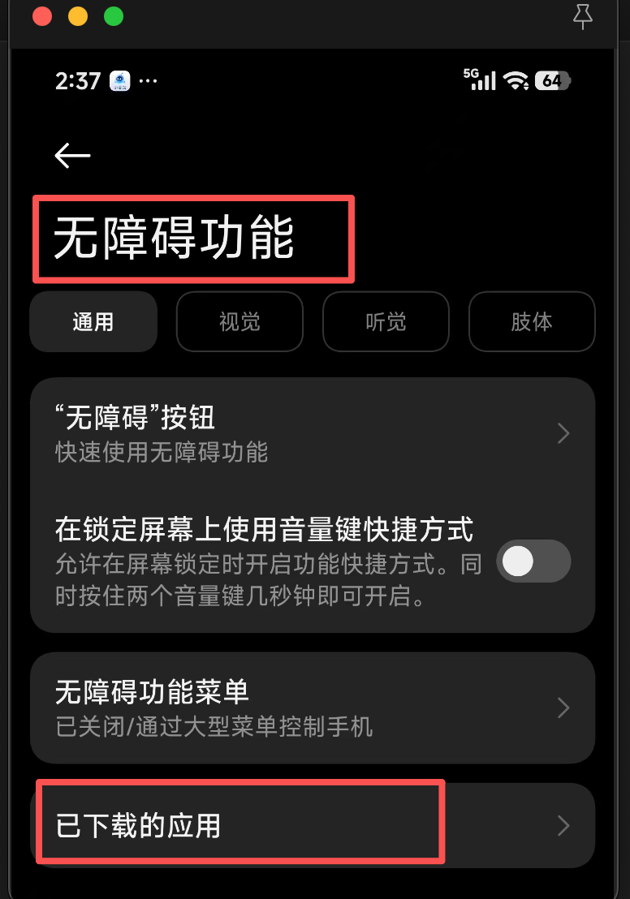
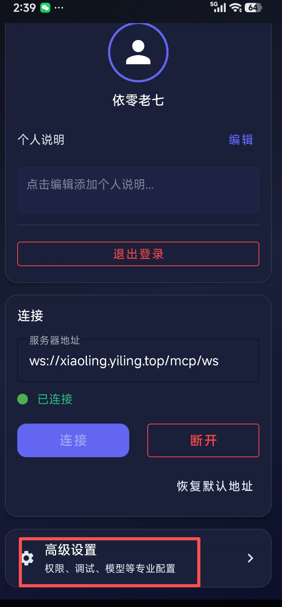
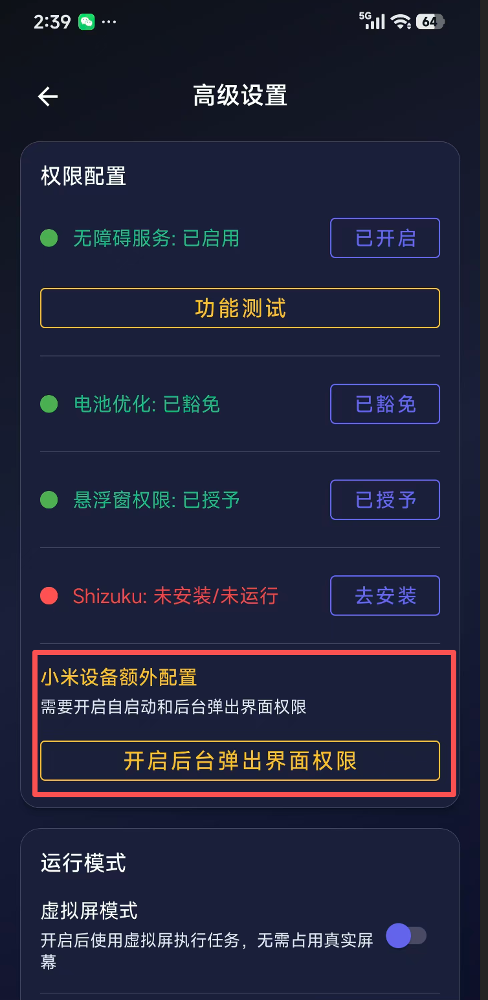
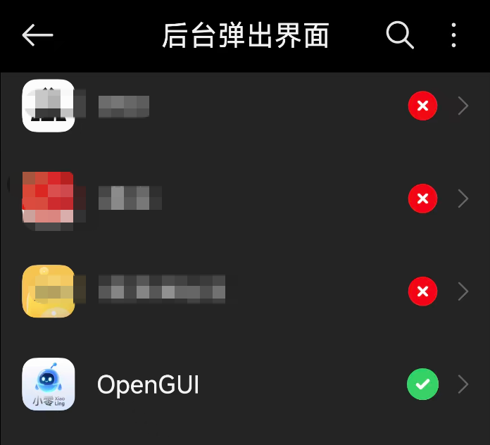
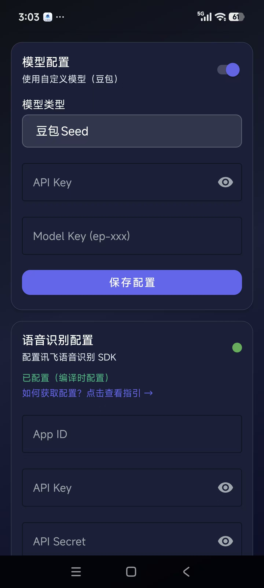

# OpenGUI Android

<div align="center">


### Android AI 驱动 GUI 自动化智能体

[English](README_EN.md)

[功能特性](#功能特性) • [快速开始](#快速开始) • [配置说明](#配置说明) • [架构设计](#架构设计) • [贡献指南](#贡献指南)

</div>

---

## 简介

**OpenGUI Android** 是一个开源的 AI 智能体，结合语音识别和 GUI 自动化功能，让您能够通过自然语音命令控制 Android 设备。它使用讯飞星火链 SDK 进行实时语音识别，并通过 WebSocket 与后端 AI 服务器通信，执行智能化的 GUI 操作。

## 功能特性

- **语音控制** - 按住录音的实时语音识别
- **AI 自动化** - 基于辅助功能的智能 GUI 自动化
- **屏幕理解** - AI 驱动的 UI 元素检测与分析
- **悬浮助手** - 系统级语音助手，可在任何应用中使用
- **多 Agent 支持** - 支持多个不同能力的 AI Agent
- **定时任务** - 任务调度与自动化
- **技能系统** - 可自定义的自动化工作流技能
- **实时反馈** - 可视化状态指示和通知更新
- **离线模式** - 无需后端的本地操作（功能受限）

## 快速使用
### 注册用户
1. 浏览器打开 https://www.yiling.top/ 在该网站进行用户注册
2. 申请准入码
3. 等待审批(再次点击申请准入码可以看到最新进度以及准入码)

### 下载apk
...


### 安装&登录&授权
1. 安装完成后，输入用户名、密码以及上面申请的准入码 完成登录
2. 下面开始进行app授权
- 登录后会自动弹出授权引导页，依次进行相关权限授权就好



其中有几个容易配错或不容易找到的点：

 

小米手机在权限引导完之后，还需要额外进行下配置

  

### 配置模型
点击OpenGUI首页左上角的设置按钮 >> 高级设置
+ 配置大模型（下拉已做好排序,建议配置doubao-seed-1.8）
+ 配置语音识别模型：当前支持的是讯飞语音 （不配置首页会降级为文字输入）


### 开始使用
回到首页，开始你的gui探索吧。
以下示例仅供参考：
- 帮我买一张 xx 到 xx的高铁票
- 帮我用美团买一张 xx 电影票
- 帮我打开抖音，给第一个视频点个赞

### 更多示例：
https://www.bilibili.com/video/BV1LHFozvE8p/?spm_id_from=333.1365.list.card_archive.click&vd_source=188ebf1bb206b1bd7cdeca76fcae790d


--------

## 快速开始

### 环境要求

- Android Studio Hedgehog (2023.1.1) 或更高版本
- JDK 11+
- Android 11+ 设备 (API 30+)
- 后端 AI 服务器（或使用模拟模式进行测试）

### 1. 克隆仓库

```bash
git clone https://github.com/yourusername/opengui-android.git
cd opengui-android
```

### 2. 配置构建设置

复制配置模板并填写您的配置：

```bash
cp local.properties.example local.properties
```

编辑 `local.properties`：

```properties
# 必填：android sdk 地址(需确认自己的真实地址)
sdk.dir=~/Library/Android/sdk

# 必填：后端服务器 URL
WEBSOCKET_URL=ws://xiaoling.yiling.top/mcp/ws
API_BASE_URL=http://xiaoling.yiling.top

# 可选：讯飞 SDK 凭证（语音功能需要）
# 获取地址：https://console.xfyun.cn/app/myapp
IFLYTEK_APP_ID=your_app_id
IFLYTEK_API_KEY=your_api_key
IFLYTEK_API_SECRET=your_api_secret
```

### 3. 构建并安装

```bash
# 构建调试 APK
./gradlew assembleDebug

# 安装到已连接的设备
./gradlew installDebug

```

### 4. 授予权限

打开应用并授予相应权限

应用包含引导式权限设置流程。

### 5. 开始使用

1. 打开应用并登录或注册
2. 按照权限引导完成设置
3. 长按悬浮球开始录音
4. 说出您的指令（如："打开微信"）
5. 松开发送指令
6. 观察 Agent 自动执行操作


### Shizuku 集成（可选）

如需增强功能：
1. 安装 [Shizuku 应用](https://github.com/RikkaApps/Shizuku)
2. 启动 Shizuku 服务（需要 ADB 或 root）
3. 在 Shizuku 应用中授权 OpenGUI
4. 自动授予高级权限

## 技术栈

| 组件 | 技术 |
|------|------|
| **语言** | Kotlin 2.1.0 |
| **最低 SDK** | Android 11 (API 30) |
| **目标 SDK** | Android 36 |
| **构建系统** | Gradle 8.13.2 + Kotlin DSL |
| **架构** | MVVM + Coroutines + Flow |
| **语音识别** | 讯飞星火链 SDK |
| **语音唤醒** | 讯飞 AIKit SDK |
| **网络通信** | OkHttp + WebSocket |
| **数据库** | Room（定时任务） |
| **异步处理** | Kotlin 协程 |
| **节点选择** | GKD Selector |

## 开发指南

### 构建

```bash
# 清理构建
./gradlew clean

# 构建调试 APK
./gradlew assembleDebug

# 构建发布 APK
./gradlew assembleRelease

# 运行测试
./gradlew test
./gradlew connectedAndroidTest
```

